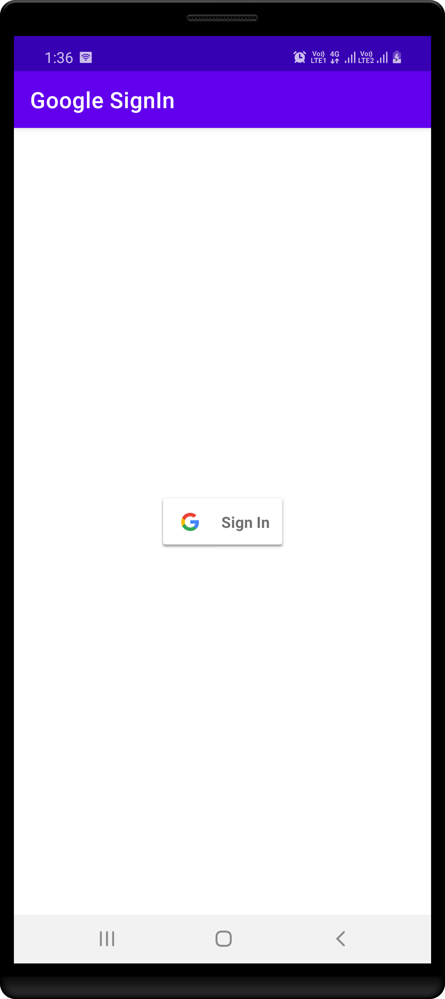
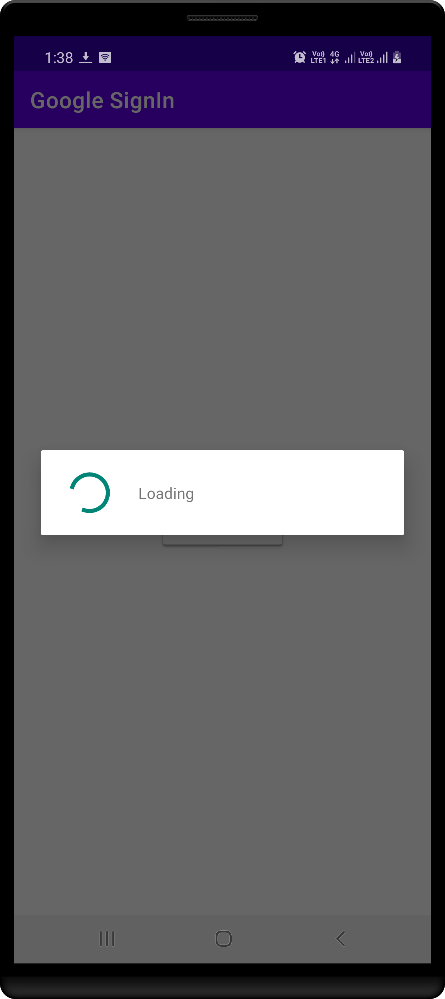
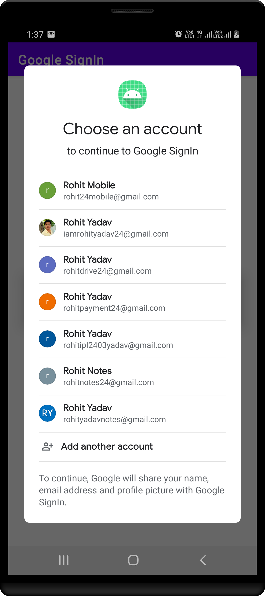
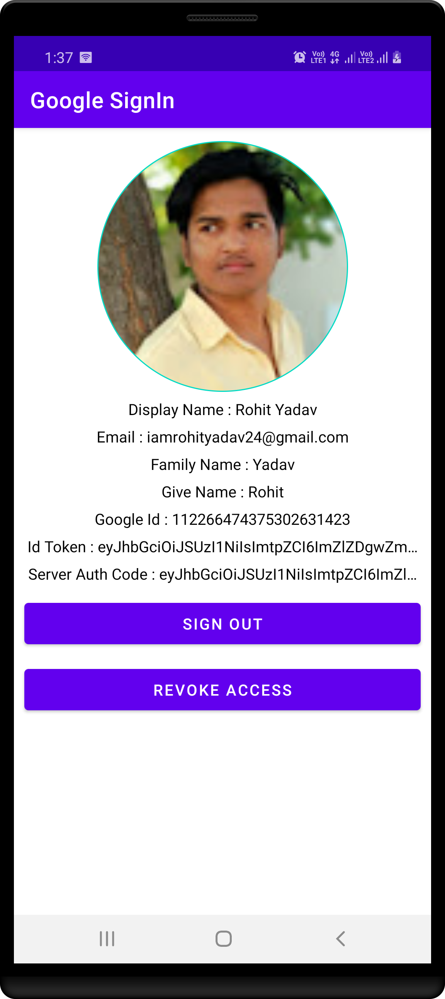

# JAVA - Google SignIn Made Easy

This code helps you to add Google Sign In option in your app with few lines of code.

Register Your App on Google Cloud Click Here [**this link**](https://developers.google.com/identity/sign-in/android/sign-in)

Let SocialSignIn support

- Google Sign-In
- Get user details :

PhotoUrl, DisplayName,  Email, FamilyName, GivenName, Google Id, IdToken, ServerAuthCode

|    First 1   |     First 2     |     First 3     |    First 4      |
|--------------|-----------------|-----------------|-----------------|
|  |  |  |  |

## Author ##

Rohit Yadav

[rohitnotes24@gmail.com](mailto:rohitnotes24@gmail.com)

[http://badasoftware.com/](http://badasoftware.com/)
